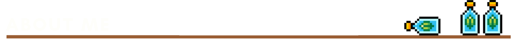

<!-- INFO BANNER -->

<!-- ABOUT ME SECTION -->

<h3>
    Hello, I'm Roy!
    
</h3>

- 🔭 I’m currently studying a System Engineering Degree at <a href="https://tec.mx/" target="blank">ITESM</a>

- 🌱 I’m currently learning **App Development, Web Implementation and OpenGL.** 

- 🤝 I’m available for freelancing.

- 📝 I regularly write articles on [Placeholder](Placeholder)

- 💬 Ask me about **Automatas, Flex & Yacc!**

- ⚡ Fun fact: I love to be involved in social proyects in beneffit of the community!
 

<!-- CONTACT INFORMATION -->
<h2 align="center">
  You can contact me by:
</h2>

 
  
  
  

  
  
  
 

<!-- ABOUT ME SECTION -->

  
<h3>🌐 Languages</h3>

            

        
      

        

          
        

  
<h3>📊 Stasistic</h3>

        

          
       

      
     </samp>
  
    

  
<h3>🏆 Achievements</h3>

        

          
       

      
     </samp>
  
    

