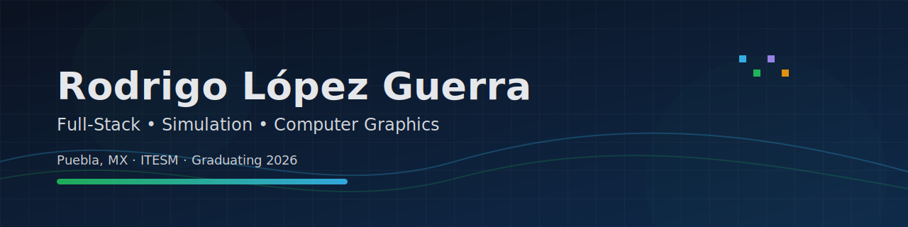
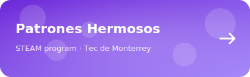
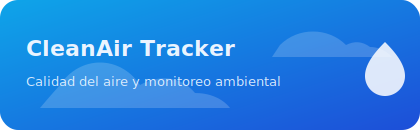

<!-- ====== HERO ====== -->
<p align="center">
  
</p>

<p align="center">
  <a href="https://www.linkedin.com/in/rodrigologu/"></a>
  <a href="mailto:rock.gule@gmail.com"></a>
  <a href="https://instagram.com/rdglopz"></a>
  <a href="https://twitter.com/rdglopz"></a>
</p>

<p align="center">
  <b>CS @ ITESM (Jun 2026)</b> · Puebla, MX · <b>Full‑Stack</b> · <b>Simulation</b> · <b>Computer Graphics</b>
</p>

<p align="center">
  <i>Seeking challenges — building immersive & interactive experiences with social impact.</i>
</p>

---

```txt
$ whoami
Rodrigo López Guerra

$ focus
Interactive web apps • system dynamics simulation • real‑time graphics

$ values
clarity > complexity | learn fast | ship often | build for impact
```

---

## 🧭 Currently

- 🔭 Building web platforms with simulation (Django · Next.js · PostgreSQL).
- 🎮 Exploring real‑time graphics (OpenGL, shaders, Unity).
- 🤝 Open to collaboration, freelance, and impact projects.

<table>
  <tr>
    <td width="33%" valign="top">
      <h3>🧩 Systems</h3>
      <ul>
        <li>REST APIs & architecture</li>
        <li>Databases (SQL)</li>
        <li>Testing, DX & quality</li>
      </ul>
    </td>
    <td width="33%" valign="top">
      <h3>📈 Simulation</h3>
      <ul>
        <li>System Dynamics (stock & flow)</li>
        <li>Computational modeling</li>
        <li>Interactive dashboards</li>
      </ul>
    </td>
    <td width="33%" valign="top">
      <h3>🎨 Experiences</h3>
      <ul>
        <li>OpenGL / graphics</li>
        <li>Game dev (Unity)</li>
        <li>Learning‑oriented UX</li>
      </ul>
    </td>
  </tr>
</table>

---

## ⭐ Featured Projects

<table>
  <tr>
    <td align="center">
      <a href="https://github.com/iiRoy/PatronesHermosos-Corrected" title="Part of a STEAM program at Tec de Monterrey">
        
      </a>
    </td>
    <td align="center">
      <a href="https://github.com/iiRoy/CleanAir-Tracker">
        
      </a>
    </td>
  </tr>
  <tr>
    <td align="center">
      <a href="https://github.com/CharismaticTopHat/trafficSimulation">
        
      </a>
    </td>
    <td align="center">
      <a href="https://github.com/iiRoy/Volca-Popocatepetl-Risk">
        
      </a>
    </td>
  </tr>
</table>

<details>
  <summary><b>🧪 Hackathons + other repos</b></summary>
  <br/>
  <ul>
    <li><a href="https://github.com/iiRoy/GShase">GShase</a> — Hack Puebla project (PHP).</li>
    <li><a href="https://github.com/iiRoy/Reforest-Revenge-COPY">Reforest-Revenge</a> — game jam (Unity/C#).</li>
    <li><a href="https://github.com/iiRoy/Analisis-COVID-19">Analisis-COVID-19</a> — analysis in R.</li>
    <li><a href="https://github.com/iiRoy/Modmail-Bot-Discord">Modmail-Bot-Discord</a> — modmail bot in Discord.js.</li>
  </ul>
</details>

---

## 🛠️ Toolbox (what I use most)

<p align="center">
  <!-- Nota: si prefieres no depender de skillicons.dev, cámbialo por badges o íconos locales -->
  
  <br/>
  
</p>

---

## 🏆 Achievements & leadership

- 🥈 Hack Puebla 2023 — 2nd place
- 🥈 Global Game Jam 2023 — 2nd place (Most Creative Project)
- 🏅 Hack Puebla 2024 — Honorable mention
- 🤝 Peer Mentor @ ITESM
- 🧭 Student Government — President (Social Responsibility Council)

<p align="center">
  <!-- Placeholder shown until the daily animation is built -->
  
</p>
