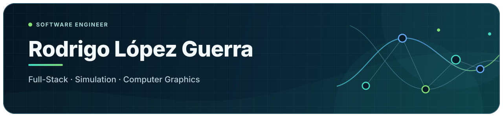
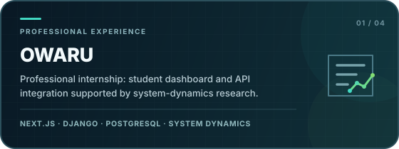
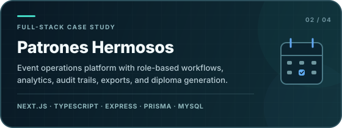
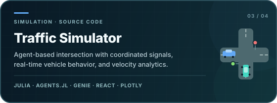
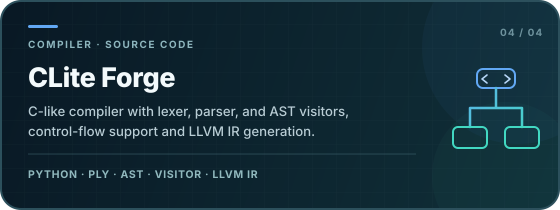

<!-- ====== HERO ====== -->

  

  
  
  

  <strong>Computer Science @ Tecnológico de Monterrey</strong> 
  GPA 94.37/100 · Mexico

  My work spans <strong>full-stack web development</strong>, <strong>computational simulation</strong>, 
  <strong>computer graphics</strong>, and <strong>compiler construction</strong>.

<h2 align="center">Selected work</h2>

  Four projects selected for professional experience, product depth, technical range, and visible implementation.

  
  
    
  
  

  <a href="https://github.com/iiRoy?tab=repositories"><strong>Explore all repositories →</strong></a>

<h2 align="center">Tools & technologies</h2>

  Languages  
  

  Frameworks, data & tools  
  

  
  
  
  

<h2 align="center">Let's connect</h2>

  I'm open to software engineering opportunities and collaborations involving 
  product development, simulation, platform engineering, or interactive systems.

  <a href="mailto:rock.gule@gmail.com"><strong>Start a conversation</strong></a>
  &nbsp;·&nbsp;
  <a href="https://www.linkedin.com/in/rodrigologu/">Connect on LinkedIn</a>
  &nbsp;·&nbsp;
  <a href="https://github.com/iiRoy?tab=repositories">View all repositories</a>

  <!-- Placeholder shown until the daily animation is built -->
  

